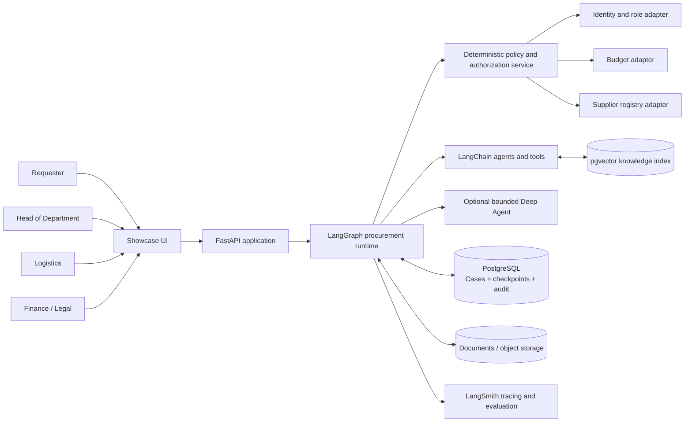
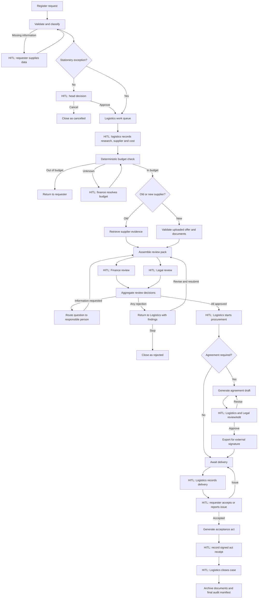
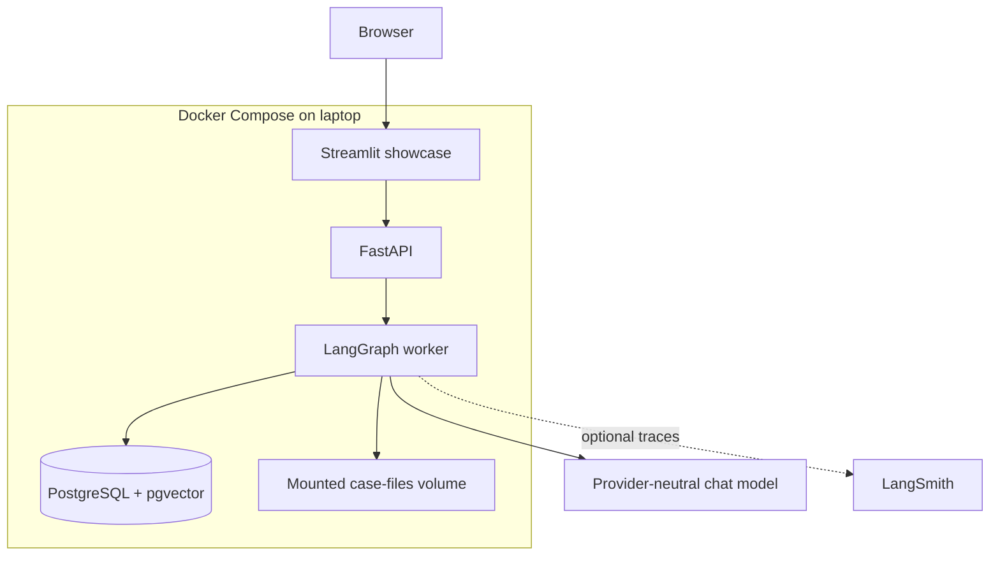

# Step-by-Step Architecture: Logistics Procurement Above GEL 5,000

**Status:** Target architecture with current cloud-demo implementation status
**Target:** Cloud demo now; financial-organization pilot after policy, identity, and security hardening
**Source process:** Generalized internal procurement workflow

**Recommended implementation language:** Python 3.12

**Primary orchestration:** LangGraph

**Supporting framework:** LangChain

**Optional bounded harness:** Deep Agents
**Observability and evaluation:** LangSmith

## 1. Executive architecture decision

The prototype should be built as a **governed procurement workflow with agentic capabilities**, not as an autonomous procurement agent.

The process contains long-running cases, deterministic routing, multiple human approvals, parallel departmental review, missing-information loops, document generation, delivery confirmation, and durable audit requirements. LangGraph is therefore the correct system of control.

| Layer | Choice | Responsibility |
|---|---|---|
| Workflow runtime | LangGraph | Case state, branching, parallel review, interrupts, resumption, retries |
| Agent framework | LangChain | Model adapters, tools, retrieval, structured outputs |
| Complex research harness | Deep Agents, optional | Bounded supplier-document investigation and complex drafting tasks |
| Persistence | PostgreSQL + LangGraph Postgres checkpointer | Durable case state, pause/resume, execution history |
| Knowledge retrieval | PostgreSQL/pgvector for prototype | Supplier files, legal templates, policies, evidence retrieval |
| API | FastAPI | Authentication boundary, case commands, integrations, UI backend |
| Showcase UI | Streamlit initially | Request form, work queues, approval cards, timeline, document review |
| Files | Local volume for laptop; object storage in cloud | Offers, supplier documents, generated agreements, acceptance acts |
| Observability | LangSmith | Traces, dataset evaluation, prompt/tool debugging |

### Critical design rule

> LangGraph controls what happens next. Policy code controls what is allowed. Agents prepare evidence and drafts. Authorized employees approve, reject, edit, sign, accept, and close.

An LLM must never be the source of truth for budget, authorization, supplier status, or approval completion.

## 1.1 Current technical state (as of 26 July 2026)

The system is no longer architecture-only. A cloud-hosted prototype is implemented and can run a durable procurement case through its current configured workflow. The following table deliberately separates what is operating now from what remains target-state work.

| Area | Current implementation | Status / boundary |
|---|---|---|
| User interface | React Request Hub, generated from the Lovable frontend and deployed on Vercel. It provides a new-request form, case views, role-specific action cards, documents, timeline, and a demo-user selector. | **Operating for demo.** The former Streamlit UI remains local only and is no longer the primary showcase interface. |
| Trusted API | FastAPI service deployed as a Vercel Python function. The browser calls `/api/cases`, `/api/cases/{id}`, `/api/cases/{id}/actions`, and `/api/cases/{id}/documents`. | **Operating for demo.** API commands remain server-side; the browser cannot directly resume a LangGraph thread. |
| Workflow runtime | LangGraph controls registration, head approval, Logistics preparation, budget check, Logistics authorization, control reviews, CEO decision where required, procurement start, delivery, requester acceptance, and closure. | **Operating for demo.** Each case uses its case number as the stable LangGraph thread ID. |
| Approval bands | Logistics enters supplier, offer reference, and estimated cost after Head approval. `< 500 GEL` requires Head of Logistics approval; `500–4,999 GEL` requires Director of Logistics approval; `5,000–19,999 GEL` additionally requires CEO approval; `>= 20,000 GEL` stops at an explicit Board-flow placeholder. | **Implemented as prototype policy code.** The Board of Directors flow is intentionally not built yet. |
| Human-in-the-loop | Head, Logistics, Head/Director of Logistics, Finance, Legal, CEO, and requester acceptance are explicit LangGraph interrupts. A user must choose an action before the graph advances. | **Operating for demo.** Finance and Legal have independent, role-specific review queues. |
| Case durability | Supabase PostgreSQL stores the business case projection, audit records, case membership, and document metadata. LangGraph uses `PostgresSaver` in the private `langgraph` schema, so paused cases can resume after a Vercel cold start. | **Operating and verified.** LangGraph checkpoints are runtime state; the business audit tables remain the business record. |
| Documents | Requester and Logistics attachments are stored in the private Supabase `case-attachments` bucket, with metadata recorded against the case. Agreement templates are stored separately. | **Operating for demo.** Malware scanning, immutable retention controls, and a complete agreement-generation/review lifecycle remain pilot/production work. |
| Budget | A read-only monthly Google Sheets budget adapter is available. The requester does not see or provide an amount; Logistics supplies the estimated cost before the budget check. | **Operating for configured demo data.** Production requires an authoritative Finance integration, reservation rules, reconciliation, and error/SLA handling. |
| Agents and retrieval | LangChain agents can prepare supplier evidence and review-pack summaries. A pgvector knowledge base and embeddings are available when approved model credentials are configured; deterministic fallback behavior is retained. Deep Agents are not in the approval-critical path. | **Prototype capability.** Agent outputs are advisory, evidence-oriented, and must never create approvals or alter policy routing. |
| Observability | LangSmith tracing is enabled for the `agentic-procurement-orchestration` project in the Vercel Production environment. | **Enabled for approved demo data only.** Do not trace real organizational data to LangSmith Cloud until data residency, redaction, retention, and security approval are complete. |
| Identity and access | The deployed UI currently uses a demo-persona selector sent to the API as `X-Demo-User-Id`; the backend provisions corresponding demo identities for case persistence. | **Not production-ready.** Replace this with Supabase Auth or organization SSO, JWT verification, role/department authorization, delegation, and audited access controls before a pilot. |

### Current implementation gaps before an organization pilot

1. Replace demo personas with real Supabase Auth or organization SSO, and enforce authorization from verified identities rather than a browser-supplied demo header.
2. Expose independent Finance and Legal work queues and decisions in the frontend; do not use a shared reviewer action for an organization pilot.
3. Move amount thresholds, document requirements, routing, approval validity, and delegation rules from prototype code into a versioned, organization-approved policy configuration.
4. Complete the `>= 20,000 GEL` Board of Directors/tender flow, including its roles, documents, decision authority, and rework paths.
5. Add production document controls: anti-malware scanning, classification, retention, immutable versions, download authorization, and evidence hashes.
6. Add command idempotency, optimistic-concurrency enforcement, stale-approval handling, operational alerting, and a complete audit export.
7. Obtain formal approval for model usage, retrieval corpus, external tracing, network topology, secrets management, backup/restore, and data-residency controls.

The valid governing principle remains unchanged: **LangGraph determines the approved process path, deterministic policy determines what is allowed, agents prepare information, and humans retain every binding business decision.**

## 2. Scope of the prototype

### In scope

- Register material or service requests through a chat-style form.
- Validate required fields and ask the requester for missing information.
- Route non-stationery requests to the requester's head of department.
- Route approved cases to Logistics.
- Capture supplier research, offer, cost, and old/new supplier status.
- Check department budget through a mock or real read-only adapter.
- Retrieve existing supplier legal documents and attach evidence.
- Route a review pack to Finance and Legal in parallel.
- Allow every reviewer to approve, reject, or request information.
- Return rejected cases to Logistics with attributable comments.
- Generate a draft supplier agreement from an approved template.
- Require Logistics and Legal review before a document can be exported.
- Record delivery, requester acceptance, acceptance-act generation, signed-document receipt, and closure.
- Preserve a complete case timeline and evidence trail.

### Explicitly out of scope for the first prototype

- Autonomous supplier selection or award.
- Autonomous approval on behalf of any department.
- Contract signature or payment execution.
- Production integration with core enterprise systems.
- Internet-wide supplier due diligence.
- Final tender rules, procurement limits, or organization-specific signing mandates that are absent from the source.

## 3. Source-process gaps treated as configuration

The prototype must not silently invent policy. The following items require organization confirmation and will initially be represented as configurable rules or mock adapters:

1. Whether “above GEL 5,000” has additional bands or tender/committee thresholds.
2. Whether both review departments assess every request or routing depends on category, amount, supplier, or policy classification.
3. What qualifies as an old supplier and which system is authoritative.
4. Who owns the budget and what “in budget” means: available, reserved, or merely planned.
5. Whether Logistics selects a supplier or presents alternatives for another authority to select.
6. Required documents for each category and old/new supplier condition.
7. Agreement templates, clause rules, and signing authority.
8. Rework behavior after rejection: resubmit to all reviewers or only affected reviewers.
9. SLA, escalation, delegation, and absence rules.
10. Retention, classification, and access rules for case documents.
11. Whether stationery is truly exempt from head approval above GEL 5,000.
12. What event legally constitutes procurement authorization and case closure.

These rules belong in a versioned `PolicyConfig`, not in prompts.

## 4. System context



The model receives the minimum case context required for the current task. It does not receive unrestricted access to every organization document or user-visible case.

## 5. End-to-end LangGraph workflow



### Parallel-review implementation

Finance and Legal reviews fan out as independent LangGraph branches. Each branch uses an `interrupt()` payload containing the review pack, evidence links, permitted actions, and reviewer role. A reducer accumulates decisions. The aggregation node evaluates completion and routes deterministically.

The prototype should support `approve`, `reject`, and `request_information`. “Request information” creates a structured question with an owner; it must not be hidden in free-text chat.

## 6. Human-in-the-loop control map

| Decision or action | Agent contribution | Human authority |
|---|---|---|
| Request completeness | Detect missing fields; suggest category | Requester confirms submitted facts |
| Department need | Summarize request and evidence | Head approves or cancels |
| Supplier research | Search authorized records; compare offers | Logistics selects/records candidate |
| Budget | Display authoritative adapter result | Finance resolves ambiguity/approves |
| Finance review | Summarize budget and commercial evidence | Finance approves/rejects/requests info |
| Legal review | Find supplier documents; compare against checklist | Legal approves/rejects/requests info |
| Procurement start | Present completed approval pack | Logistics explicitly starts procurement |
| Agreement | Fill approved template and identify unresolved fields | Logistics/Legal edit and approve; authorized people sign externally |
| Delivery | Prepare acceptance record | Logistics records delivery; requester accepts |
| Closure | Check required artifacts and unresolved tasks | Logistics closes case |

No agent can convert its own recommendation into an approval.

## 7. Agent boundaries

### 7.1 Request Intake Agent — LangChain

Uses structured output to map chat/form input into the case schema, identify missing required fields, and draft a concise request summary. Its category suggestion is advisory until confirmed by the requester or Logistics.

### 7.2 Supplier Evidence Agent — LangChain RAG

Queries only authorized supplier and legal-document indexes. It returns citations, document versions, retrieval timestamps, missing-document flags, and a confidence indicator. It does not declare a supplier legally acceptable.

### 7.3 Review Pack Agent — LangChain

Builds a department-specific evidence summary from raw case data without changing the underlying evidence. Each claim must cite a case field or attached document.

### 7.4 Agreement Drafting Agent — LangChain structured generation

Fills an approved, versioned agreement template. It must not invent missing commercial or legal fields. Missing fields become explicit tasks for Logistics. Every generated clause records template provenance.

### 7.5 Deep Research Agent — optional Deep Agents subcomponent

Deep Agents is justified only when a task genuinely requires planning over many documents, maintaining a working file set, or delegating document analysis. A bounded Deep Agent may:

- inspect a case-specific virtual folder;
- build a supplier evidence checklist;
- delegate separate document checks;
- write a research report into a controlled output path.

It must have read-only access to source documents and write access only to a case workspace. It cannot call approval, budget reservation, supplier-master mutation, contract export, payment, or closure tools. Every report is evidence for a human/graph decision, not a transition authority.

**Prototype recommendation:** implement the first showcase without Deep Agents in the critical path. Add the bounded research agent only after the deterministic graph and HITL behavior are stable. This demonstrates correct framework selection instead of adding autonomy for presentation value.

## 8. Procurement case state

Use typed, raw state. Prompt-ready summaries are generated inside nodes rather than stored as the source of truth.

```text
ProcurementCaseState
├── case_id, thread_id, version, status
├── requester {user_id, department_id, manager_id}
├── request {category, subcategory, description, deadline, amount, currency}
├── supplier {supplier_id, old_or_new, candidate_status}
├── budget {source, checked_at, available, amount, reference_id}
├── documents[] {id, type, version, checksum, storage_uri, classification}
├── approvals {head, finance, legal}
├── information_requests[] {owner, question, status, response, timestamps}
├── agreement {template_id, version, draft_uri, review_status}
├── delivery {delivered_at, recorded_by, requester_acceptance}
├── acceptance_act {draft_uri, signed_uri, received_at}
├── audit_events[]
├── errors[]
└── next_actions[]
```

Important implementation rules:

- Use one stable LangGraph `thread_id` per procurement case.
- Use append reducers for audit events, questions, errors, and departmental decisions.
- Use idempotency keys for every external write.
- Never perform a non-idempotent side effect before `interrupt()`; interrupted nodes restart from their beginning when resumed.
- Store files outside graph state and keep immutable URIs, versions, and hashes in state.
- Treat model output as proposed structured data; validate it with Pydantic before use.

## 9. Deterministic policy and authorization layer

The policy layer is conventional code backed by versioned configuration. It evaluates:

- whether the user may create, view, or act on a case;
- whether head approval is required;
- which control departments must review;
- required documents by category and supplier status;
- whether a case can enter or leave a state;
- whether all required approvals are current;
- whether an approval became stale after material case changes;
- whether delivery and closure prerequisites are complete.

Every transition is a command with these fields:

```text
case_id, expected_case_version, command_type, actor_id, actor_role,
payload, idempotency_key, timestamp, correlation_id
```

The service rejects unauthorized commands, stale versions, invalid transitions, and duplicate execution.

## 10. Persistence, audit, and document integrity

### Local showcase

- PostgreSQL stores application records and LangGraph checkpoints.
- The Postgres checkpointer permits a case to remain paused across process restarts.
- A local mounted directory stores documents.
- SHA-256 checksums and immutable document versions are recorded in PostgreSQL.
- LangSmith tracing is enabled when credentials are available; the prototype must still run without it.

### Audit model

Maintain two related histories:

1. **Workflow checkpoints** for runtime durability and debugging.
2. **Business audit events** for organization-readable accountability.

Checkpoint history is not a substitute for a business audit log. Each material action records actor, role, source, previous status, new status, evidence IDs, policy version, model/prompt version when applicable, and correlation ID.

Sensitive prompts and traces must be redacted before they leave the organization environment. For a production deployment, evaluate LangSmith self-hosted/hybrid or route OpenTelemetry traces to an approved internal platform.

## 11. Local showcase architecture



Recommended showcase personas: requester, head, Logistics, Finance, and Legal. A demo-only role switcher can simulate users, but the architecture must isolate this from real authentication.

Recommended demo scenario:

1. Request equipment above GEL 5,000.
2. Head approves.
3. Logistics records a new supplier and offer.
4. Budget adapter returns in-budget.
5. Finance and Legal receive parallel approval cards.
6. Legal requests one missing document.
7. Logistics supplies it; affected reviews resume.
8. All departments approve.
9. Agreement draft is generated and human-edited.
10. Delivery, requester acceptance, acceptance act, and closure are recorded.
11. Timeline shows every human and agent action with evidence.

## 12. Cloud-ready mapping

The same containers can be deployed to AWS, Azure, or GCP without changing graph semantics.

| Prototype component | Cloud mapping |
|---|---|
| Streamlit/FastAPI/worker | Managed containers or Kubernetes |
| PostgreSQL/pgvector | Managed PostgreSQL with private networking |
| Local document volume | Encrypted object storage with versioning |
| Local secrets | Cloud secret manager and workload identity |
| Demo role switcher | Organization SSO with OIDC/SAML and group-to-role mapping |
| Mock budget/supplier adapters | Private API integrations through an integration layer |
| LangSmith cloud | Approved LangSmith cloud, hybrid/self-hosted, or internal OpenTelemetry backend |
| Model API | Approved hosted model endpoint or organization-controlled model gateway |

Required production controls include encryption in transit and at rest, network isolation, least-privilege service identities, document malware scanning, data-loss prevention, key rotation, backup/restore tests, retention enforcement, prompt-injection defenses, and security monitoring.

## 13. API and UI surfaces

### API command endpoints

- `POST /cases` — register request.
- `GET /cases/{id}` — authorized case view.
- `GET /work-queue` — role-filtered pending actions.
- `POST /cases/{id}/commands` — approve, reject, request info, provide info, record research, start procurement, record delivery, accept delivery, close.
- `POST /cases/{id}/documents` — upload versioned evidence.
- `GET /cases/{id}/timeline` — business audit timeline.
- `POST /cases/{id}/resume` — internal endpoint that translates authorized decisions into LangGraph `Command(resume=...)`.

The client never resumes a graph directly. FastAPI authenticates the actor, authorizes the business command, validates optimistic concurrency, and only then resumes the correct thread.

### UI views

- Request form/chat.
- My requests and status.
- Role-specific work queue.
- Approval card with evidence and comments.
- Logistics case workspace.
- Agreement review with generated-versus-template provenance.
- Delivery/acceptance view.
- Full timeline and audit manifest.

## 14. Failure handling

| Failure type | Handling |
|---|---|
| Model/provider timeout | LangGraph retry policy, then manual fallback |
| Structured-output validation failure | Retry with validation feedback; never advance state |
| Budget/supplier adapter unavailable | Pause case and create an operational task |
| Missing user information | Interrupt and route to named owner |
| Reviewer rejection | Deterministic return to Logistics with structured findings |
| Worker restart | Resume from PostgreSQL checkpoint using same thread ID |
| Duplicate command | Return prior result using idempotency key |
| Unexpected error | Preserve checkpoint, record correlation ID, alert operator |

Manual operation must remain possible if the model is unavailable. The workflow should degrade to form-based processing rather than stop procurement.

## 15. Step-by-step implementation plan

### Step 0 — Confirm policy decisions

- Resolve the 12 gaps listed in section 3 with Logistics, Finance, Legal, and Information Security.
- Collect anonymized examples of accepted, rejected, and returned cases.
- Define the minimum required document set and role matrix.
- Agree on a representative demo scenario and success criteria.

**Exit criterion:** a signed process decision table and role/permission matrix.

### Step 1 — Build a deterministic vertical slice

- Create typed domain models and transition rules.
- Build LangGraph nodes for registration, head approval, Logistics preparation, parallel review, aggregation, delivery, and closure.
- Add `interrupt()` only at explicit human decision points.
- Use PostgreSQL checkpoints from the start; use one thread per case.
- Implement mock identity, budget, and supplier registry adapters.
- Add a minimal Streamlit work queue and approval cards.

**Exit criterion:** a case can complete end-to-end without any LLM call.

### Step 2 — Add agentic intake and review preparation

- Add request classification with Pydantic structured output.
- Add completeness detection and question drafting.
- Add cited supplier-document retrieval.
- Add departmental review-pack summaries.
- Ensure the workflow remains functional when agents are disabled.

**Exit criterion:** agents reduce preparation effort but cannot change authorization state.

### Step 3 — Add controlled document generation

- Introduce versioned agreement and acceptance-act templates.
- Generate drafts only from approved case data.
- Make missing values explicit instead of hallucinating them.
- Add side-by-side human review and immutable draft versions.

**Exit criterion:** every generated field is attributable to case data, a template, or an identified human edit.

### Step 4 — Add evaluation and operational controls

- Create a LangSmith dataset from anonymized historical scenarios.
- Evaluate classification, missing-document detection, groundedness, correct citations, and unsafe-action refusal.
- Add trace tags for case, workflow version, policy version, prompt version, and model version.
- Add latency, cost, error, override, and completion metrics.
- Test restart/resume, duplicate commands, reviewer concurrency, stale approvals, and model outage.

**Exit criterion:** agreed quality thresholds pass and no test permits unauthorized state advancement.

### Step 5 — Optional bounded Deep Agent experiment

- Give the research agent a case-scoped virtual filesystem.
- Permit only read/search and controlled report-writing tools.
- Compare it against the simpler RAG agent on complex supplier cases.
- Keep it only if evidence quality or analyst time improves enough to justify additional variability.

**Exit criterion:** measurable benefit over the simpler implementation with equal or better control.

### Step 6 — Organization showcase and pilot decision

- Demonstrate the golden path, missing-information loop, rejection/rework path, model-outage fallback, and audit timeline.
- Run a limited shadow pilot using historical or duplicated cases.
- Measure cycle time, manual touches, routing accuracy, missing-document accuracy, human override rate, and user satisfaction.

**Exit criterion:** organization stakeholders approve or reject a limited live pilot using predefined evidence.

## 16. Suggested implementation structure

```text
agentic-procurement-orchestration/
├── README.md
├── pyproject.toml
├── .env.example
├── docker-compose.yml
├── docs/
│   ├── STEP_BY_STEP_ARCHITECTURE.md
│   ├── POLICY_DECISIONS.md
│   └── THREAT_MODEL.md
├── src/procurement/
│   ├── api/
│   ├── domain/
│   ├── graph/
│   │   ├── state.py
│   │   ├── nodes/
│   │   ├── routing.py
│   │   └── build.py
│   ├── agents/
│   ├── policies/
│   ├── adapters/
│   ├── persistence/
│   └── observability/
├── ui/
├── tests/
│   ├── unit/
│   ├── graph/
│   ├── integration/
│   ├── evaluation/
│   └── scenarios/
└── case_files/
```

Only `README.md` and this architecture document are created in the first step. The remaining structure is the proposed implementation target.

## 17. Prototype acceptance criteria

The prototype is showcase-ready only when:

- every case has a durable thread and can resume after restart;
- role checks prevent unauthorized review or state transition;
- Finance and Legal reviews can pause independently and complete in any order;
- rejection and request-information loops preserve attributable comments;
- model output cannot directly approve, reject, select, sign, pay, or close;
- all displayed agent claims link to evidence or are labeled as suggestions;
- agreement generation cannot invent missing mandatory values;
- duplicate resume/command calls do not duplicate side effects;
- the case can finish using deterministic/manual fallbacks with the model disabled;
- the audit timeline reconstructs the full business decision path.

## 18. Immediate decisions before coding

1. Confirm Python as the implementation language.
2. Select the first model provider: OpenAI, Azure OpenAI, or a local Ollama-compatible model.
3. Confirm whether the laptop showcase may send anonymized data to external model and tracing services.
4. Decide whether PostgreSQL through Docker is acceptable on the demo machine.
5. Confirm whether Deep Agents should be demonstrated in phase one or evaluated after the core workflow works.
6. Provide or approve mock supplier documents, agreement templates, and budget data.

## 19. Current LangChain ecosystem references

- [LangGraph overview](https://docs.langchain.com/oss/python/langgraph/overview)
- [LangGraph interrupts](https://docs.langchain.com/oss/python/langgraph/interrupts)
- [LangGraph persistence](https://docs.langchain.com/oss/python/langgraph/persistence)
- [Deep Agents overview](https://docs.langchain.com/oss/python/deepagents/overview)
- [LangSmith observability](https://docs.langchain.com/oss/python/langchain/observability)
- [LangSmith evaluation](https://docs.langchain.com/langsmith/evaluation)

These APIs evolve quickly; implementation must re-check the live documentation and pin tested dependency versions before coding.
